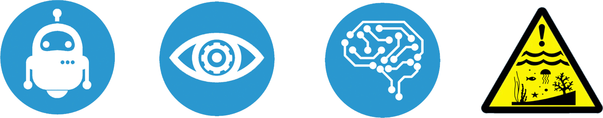

.. oplab_pipeline documentation master file, created by
   sphinx-quickstart on Thu May  7 19:32:18 2020.

Welcome to Ocean Perception's pipeline
==========================================

This is a toolchain for AUV dive processing, camera calibration and image correction.
Three main tools are used to get from the raw data to geolocalised and colour-corrected images for a particular dataset: `auv_nav <pages/auv_nav>`_, `auv_cal <pages/auv_cal>`_ and `correct_images <pages/correct_images>`_.

User's Guide
------------
.. toctree::
   :maxdepth: 2
   :caption: Contents:

   how_to_install.md
   dataset_structure
   file_format_definitions
   auv_nav
   correct_images
   example
   docker_and_singularity

API Reference
-------------

If you are looking for information on a specific function, class or
method, this part of the documentation is for you.

.. toctree::
   :maxdepth: 2

   api

Indices and tables
==================

* :ref:`genindex`
* :ref:`modindex`
* :ref:`search`
